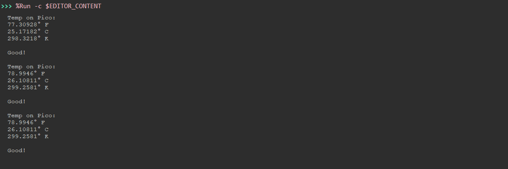

# picoTemp
## An LED Temperature Indicator Using the Raspberry Pi Pico

To Start, Please Connect a Green LED Diode to GPIO Pin 0 & Corresponding Ground & Connect a Red LED Diode to GPIO Pin 15 and Ground. Afterwards, connect a USB Power Source (e.g. Battery Pack), to see it work! (Runs main.py) by default.

The Other Python Files are use to assist main.py & some debugging tests.

When the **Green** Led Turns On, that means the temperature is **below** the threshold temperature, Red Otherwise.

## Things to Work On / Improve
1. Design of the Chassis should be More Portable & Sustainable
2. Thersehold should be adjusted manually by the user (e.g. adding a potentiometer)
3. Temperature could be displayed to the user (requires external display)

This is A Good Starting Project for Learning the Raspberry Pi Pico!

Note: There is a Hard Coded Temperature Threshold of 80° F

A Fan was placed in the Schematic to Cool the CPU to produce the most accurate comparison with Ambient Air Temperature.
 
